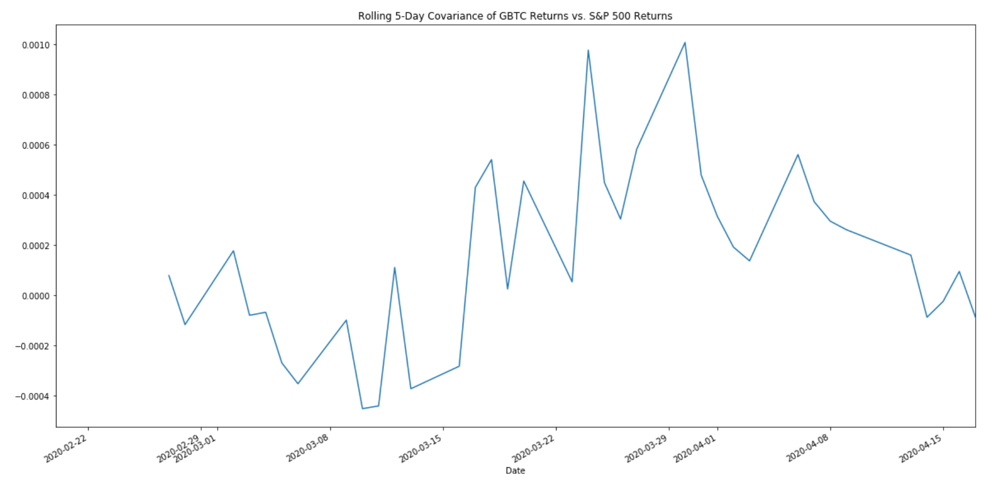

# Recent Stock Data Analysis
* Portfolio consists of Grasycale Bitcoin Trust (GBTC), Grayscale Ethereum Classic Trust (ETCG), Gold ETF (GLD), Silver ETF (SLV).
* This historical timeframe and projection takes into account the latest effects of Covid-19, Feb 19, 20120- April 19, 2020.
* I chose this group of equities because Gold and Silver are precious metals which tend to do well during times of uncertainty while Bitcoin and Ethereum Classic are cryptocurrencies which offer quite a bit of volatility but each have a capped supply.
* I see this portfolio, in different weight sets, providing a hedge to global uncertainty and inflationary characteristics of existing fiat currencies.

## Relationship of 4 Pairs (Scatter Plot)

## Daily Returns Plot

## Cumulative Profit Plot

## Correlation HeatMap

## Returns on 10,000 dollars

## Rollin 5-Day Covariance

## Beta vs. Correlation

## Monte Carlo

## Confidence Intervals

There is a 95% chance that an initial investment of 10,000 in the portfolio over the next 100 trading days will end within in the range of $2560.96 and 10401.23 dollars